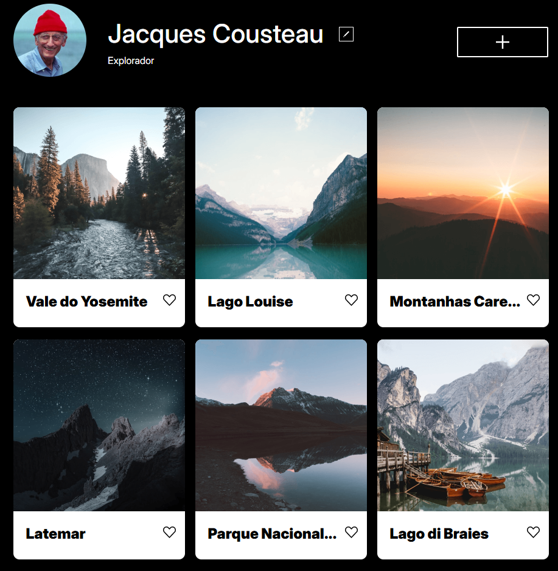
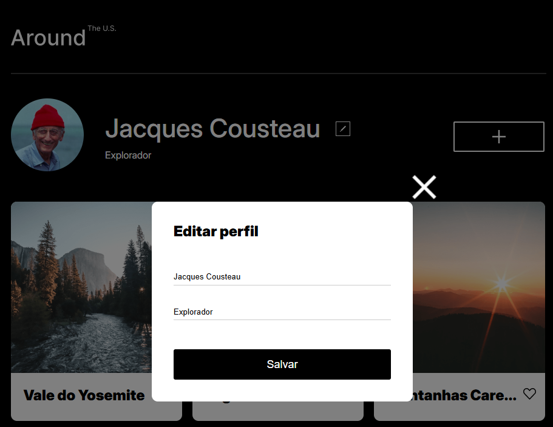

# Tripleten — web_project_around

## 📝 Sobre o projeto

O projeto **Around the US** simula um perfil de rede social. Nele, os usuários podem:

- Adicionar fotos
- Curtir publicações
- Editar nome, descrição e foto do perfil por meio de um formulário interativo.

As alterações são aplicadas de forma dinâmica, proporcionando uma experiência mais fluida ao usuário.

## 📸 Capturas de tela

## 🛠️ Tecnologias e metodologias

- HTML, CSS e JavaScript
- Metodologia BEM Flat para organização e escalabilidade do CSS
- Layout responsivo, adaptado para diferentes resoluções de tela
- Funcionalidades dinâmicas implementadas com JavaScript para maior interatividade

## 🔗 Acesse o projeto:

https://arthur-schmidt.github.io/web_project_around/
